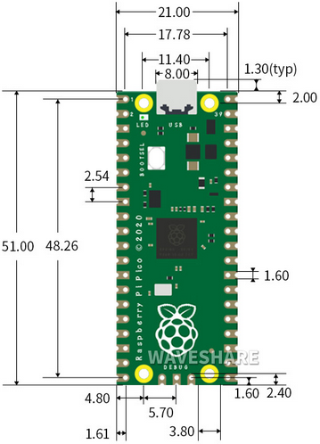
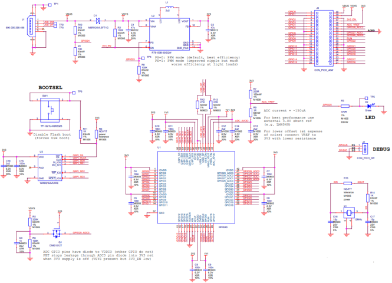

# **Raspberry Pi Pico Board：**

### **1. Introduction：**

Raspberry Pi Pico is a low-cost, high-performance microcontroller board with flexible digital interfaces. 

It integrates the RP2040 microcontroller chip designed by Raspberry Pi, with dual-core Arm Cortex M0+ processor running up to 133 MHz, embedded 264KB of SRAM and 2MB of on-board Flash memory, as well as 26 multi-function GPIO pins. 

For software development, either Raspberry Pi's C/C++ SDK, or the MicroPython is available. In this tutorial, we will use MicroPython.

### **2. Features：**

  - > RP2040 microcontroller chip designed by Raspberry Pi

  - > Dual-core ARM Cortex M0+ processor, flexible clock running up to 133 MHz
    
  - > 264kB of SRAM, and 2MB of on-board Flash memory

  - > Castellated module allows soldering direct to carrier boards

  - > USB 1.1 Host and device support

  - > Low-power sleep and dormant modes

  - > Drag & drop programming using mass storage over USB

  - > 26 multi-function GPIO pins

  - > 2×SPI, 2×I2C, 2×UART, 3×12-bit ADC, 16×controllable PWM channels

  - > Accurate on-chip clock and timer

  - > Temperature sensor

  - > Accelerated floating point libraries on-chip

  - > 8×Programmable IO (PIO) state machines for custom peripheral support

### **3. Parameters：**

Microcontroller: RP2040 microcontroller chip

CPU: Dual-core Arm Cortex-M0+ @ 133MHz

USB-to-serial chip: Built-in USB1.1 PHY host and device support, drag-and-drop download program through USB identification as mass storage.

Working voltage: 3.0V-3.6V

Working current: average 80mA

Supply current: 500mA

External power supply: DC power supply is 6-12V (recommended 9V), USB power supply is 5V.

Flash Memory: Built-in 2MB

SRAM: Built-in 264KB

Integrated crystal oscillator: 12MHz

#### 4.**Dimension Diagram：**

### 5.**Schematic Diagram：**

### 5.**Pin out**

|      PIN       | FUNCTION                                                     |
| :------------: | ------------------------------------------------------------ |
|      GND       | Ground pin                                                   |
|     Power      | VBUS(microUSB voltage)、VSYS(2-5VDC input voltage)、3V3(3.3V output voltage) 3V3\_EN(Enables Pico) |
| System Control | run (enable or disable the RP2040 microcontroller or reset)  |
|      ADC       | Raspberry Pi Pico has a total of 5 ADCs with a resolution of 12 bits, namely ADC0 (GP26), ADC1 (GP27), ADC2 (GP28), ADC3 (GP29), ADC4.  ADC3 (GP29) is used to measure VSYS on the Pico board;  ADC4 is directly connected to the built-in temperature sensor of RP2040.  ADC\_VREF can be connected to an external accurate voltmeter as ADC reference.  ADC\_GND pin serves as the ground reference. |
|      PWM       | Raspberry Pi Pico has 16 PWM channels，each of channel can control frequency and duty cycle. GPIO pin is switched to PWM |
|      UART      | Two UART： UART0,UART1                                       |
|      I2C       | Two types of I2C： I2C0 I2C1                                 |
|      SPI       | Two types of SPI：SPI0,SPI1                                  |
|   Debugging    | used in debugging code                                       |

**Related information**: [https://datasheets.raspberrypi.com/pico/pico-datasheet.pdf](https://datasheets.raspberrypi.com/pico/pico-datasheet.pdf)
