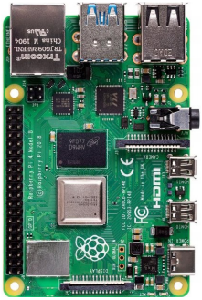
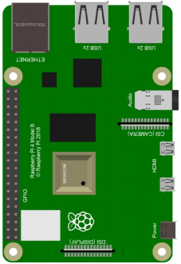

# Preparation before class for Python

Raspberry Pi is a card computer whose official system is Raspberry Pi OS, and can be installed on the Raspberry Pi, such as: ubuntu, Windows IoT. Raspberry Pi can be used as a personal server, performing camera monitoring and recognition, as well as voice interaction by connecting a camera and a voice interactive assistant. 

Also, Raspberry Pi leads out 40Pin pins that can be connected to various sensors and control LEDs, motors, etc. This can be used to make a robot with a Raspberry Pi.

## 1. Tools needed for the Raspberry Pi system

**Hardware Tool:**

  - Raspberry Pi 4B/3B/2B

  - Above 16G TFT Memory Card

  - Card Reader

  - Computer and other parts

### 1.1 Install Software Tools

**Windows System:**

(1)**Putty**

Download link:
[https://www.chiark.greenend.org.uk/\~sgtatham/putty/](https://www.chiark.greenend.org.uk/~sgtatham/putty/)

1.  After downloading the package file , double-click it and tap “Next”.
    
    
    
2.  Click “Next”.
    
    

3.  Choose “Install PuTTY files” and click “Install”.
    
    

4.  After a few seconds, click "Finish".
    
    

**SSH Remote Login software -WinSCP**

Link:
[https://winscp.net/eng/download.php](https://winscp.net/eng/download.php)

1.  After downloading the package file, click.
    
    
    
2.  Click “Accept”.

Download link:

[http://www.canadiancontent.net/tech/download/SD\_Card\_Formatter.html](http://www.canadiancontent.net/tech/download/SD_Card_Formatter.html)

1.  Unzip the SDCardFormatterv5\_WinEN package, double-click to run it.
    
    
    
    
    
    
    
2.  Click “Next” and “Install”.
    
    
    
    

3.  After a few seconds, click "Finish".
    
    
    
    ##### **Win32DiskImager**
    
    Download：http://www.nirsoft.net/utils/wnetwatcher.zip
    
    
### 1.2 Raspberry Pi Imager

Download link for **the latest version**:

[https://www.raspberrypi.org/downloads/raspberry-pi-os/](https://www.raspberrypi.org/downloads/raspberry-pi-os/)

**Old version**：

Raspbian：https://downloads.raspberrypi.org/raspbian/images/

Raspbian full：https://downloads.raspberrypi.org/raspbian_full/images/

Raspbian lite：https://downloads.raspberrypi.org/raspbian_lite/images/

We use the 2020.05.28 version in the tutorial and recommend you to use this version

(Please download this version as shown in the picture below.)

<https://downloads.raspberrypi.org/raspios_full_armhf/images/raspios_full_armhf-2021-05-28/>

## 2. Install Raspberry Pi OS on Raspberry Pi 4B

Interface the TFT memory card with a card reader, then plug the card reader into a computer’s USB port.

Use the SD Card Formatter to format a TFT memory card, as illustrated below.

#### **Burn system**

Burn the Raspberry Pi OS to the TFT memory card using Win32DiskImager software.

Don’t eject card reader after burning mirror system, build a file named SSH, then delete .txt.

The SSH login function can be activated by copying SSH file to boot category, as shown below.

Eject card reader.

#### **Log in system**

(Raspberry and PC should be in the same local area network.)

Insert TFT memory card into Raspberry Pi, connect internet cable and plug in power. If you have screen and HDMI cable of Raspberry Pi, you could view Raspberry Pi OS activating. If not, you can enter the desktop of Raspberry Pi via SSH remote login software---WinSCP andxrdp.

#### **Remote login**

**Enter default user name, password and host name on WinSCP to log in. Only a Raspberry Pi is connected in same network.**

#### **Check IP and mac address**

Click to open terminal and input the password: raspberry, and press“Enter”on keyboard.

Logging in successfully, open the terminal, input **ip a** and tap“Enter”to check IP and mac address.

From the above figure, mac address of this Raspberry Pi is a6:32:17:61:9c, and IP address is 192.168.1.128(use IP address to finish xrdp remote login).

Since mac address never changes, you could confirm IP via mac address when not sure which IP it is.

#### **Fix IP address of Raspberry Pi**

IP address is changeable, therefore, we need to make IP address fixed for convenient use.

Follow the below steps:

Switch to root user

If without root user’s password

① Set root password

Input password in the terminal: sudo passwd root to set password.

② Switch to root user

su root

③ Fix the configuration file of IP address

Firstly change IP address of the following configuration file.

(\#New IP address: address 192.168.1.99)

Copy the above new address to terminal and press“Enter”.

Configuration File**:**

echo -e '

auto eth0

iface eth0 inet static

\#Change IP address

address 192.168.1.99

netmask 255.255.255.0

gateway 192.168.1.1

network 192.168.1.0

broadcast 192.168.1.255

dns-domain 119.29.29.29

dns-nameservers 119.29.29.29

metric 0

mtu 1492

'\>/etc/network/interfaces.d/eth0

As shown below:

④ Reboot the system to activate the configuration file.

Input the restart command in the terminal: sudo reboot

You could log in via fixed IP afterwards.

⑤ Check IP and insure IP address fixed well.

(6) Log in desktop on Raspberry Pi wirelessly

In fact, we can log in desktop on Raspberry Pi wirelessly even without screen and HDMI cable.

VNC and Xrdp are commonly used to log in desktop of Raspberry Pi wirelessly. Let’s take example of Xrdp.

Install Xrdp Service in the terminal

Installation commands:

Switch to Root User: su root

Installation: apt-get install xrdp

Enter y and press“Enter”.

As shown below:

Open the remote desktop connection on Windows

Press WIN+R on keyboard and enter mstsc.exe.

As shown below:

Input IP address of Raspberry Pi, as shown below.

Click“Connect”and tap“Connect”.

192.168.1.99 is IP address we use, you could change into your IP address.

Click“Yes”.

Input user name: pi, default password: raspberry, as shown below.

Click“OK”or“Enter”, you will view the desktop of Raspberry Pi OS, as shown below.

Now, we finish the basic configuration of Raspberry Pi OS.

## 3.Preparations for Python

Python is a programming language that lets you work more quickly and integrate your systems more effectively.

Python is an interpreted, high-level and general-purpose programming language. Python's design philosophy emphasizes code readability with its notable use of significant whitespace. Its language constructs and object-oriented approach aim to help programmers write clear, logical code for small and large-scale projects.

Next to pick up Python to control 40 pin of Raspberry Pi.

#### Hardware：

| **Raspberry Pi 4B**     | **Raspberry Pi 4B Model** |
| :---------------------: | :-----------------------: |
|  ||

#### **Hardware Interfaces：**

#### **40-Pin GPIO Header Description：**

GPIO pins are divided into BCM GPIO number, physics number and WiringPi GPIO number.

We usually use WiringPi GPIO when using C language and BCM GPIO and physics number are used to Python, as shown below;

In these lessons, we use Python, so BCM GPIO number is adopted.

Note: pin(3.3 V) on the left hand is square, but other pins are round. Turn Raspberry Pi over, there is a square GPIO on the back.(you could tell from pin(3.3V).

Note: the largest current of each pin on Raspberry Pi 4B is 16mA and the aggregate current of all pins is not less than 51mA.

#### Copy Example Code Folder to Raspberry Pi：

Place example code folder to the pi folder of Raspberry Pi. and extract the example code from **Projects.zip** file, as shown below:

Double-click pythonCode\_A to check py files.

## 4.Python

#### **Update the firmware of Micropython**

If you want to run the MicroPython on the Pi Pico board, you need to upload a firmware to the pico board.

You can program via C language or MicroPython on the pico board. But you need to download the MicroPython firmware.

Note: 

MicroPython firmware is required to be downloaded once. You don’t need to download it again when programming with MicroPython. 

If you have downloaded the .uf2 program firmware written in C language, the MicroPython firmware will be overwritten, so next time you use MicroPython, you need to follow the steps below to update the Raspberry Pi Pico's firmware.

#### **Download the firmward of Micropython**

**Method 1**: 

Click to enter the website：[https://www.raspberrypi.com/documentation/microcontrollers/](https://www.raspberrypi.com/documentation/microcontrollers/)

Click “**MicroPython(**Getting started MicroPython**)**” to go to the firmware download page.

**Method 2**：

Clickto open the browser，click [https://micropython.org/download/rp2-pico/rp2-pico-latest.uf2](https://micropython.org/download/rp2-pico/rp2-pico-latest.uf2) to download the firmware

Note：

transfer the firmware（rp2-pico-20210902-v1.17.uf2）to the desktop of Raspberry pi imager

#### **Program the firmware of MicroPython**

Connect a microUSB cable to the USB port of the pico board.

Hold down **BOOTSEL**

Release the button, then there pops up a page.

Enter raspberry in the Password box, click OK.

The drive RPI-RP2 will appear on the desktop of the Raspberry Pi imager

Note：

The latest Raspberry Pi mirroring system will not display the following dialog box, and the old version will display the following dialog box

Click **OK** and open drive(RPI-RP2). Copy the file（rp2-pico-20210902-v1.17.uf2）to the RPI-RP2

After the firmware is programmed, the Pico board will reboot. Then you can run Micropython

**Serial Ports**

The MicroPython firmware is equipped with a virtual USB serial port which is accessed through the micro USB connector on Raspberry Pi Pico.

Your computer should notice this serial port and list it as a character device, most likely /dev/ttyACM0.

You can run ls /dev/tty\* to list your serial ports. There may be quite a few, but MicroPython’s USB serial will start with /dev/ttyACM. If in doubt, unplug the micro USB connector and see which one disappears. If you don’t see anything, you can try rebooting your Raspberry Pi.

Enter the following command to install minicom:

sudo apt install minicom

Select Y

Enter the following commander, press **Enter** and open minicom

minicom -o -D /dev/ttyACM0

Press Ctrl + B

Enter print("Hello World") at the terminal and press Enter，then **Hello World** will be displayed.

#### **Install Thonny**

The Raspberry Pi Imager that we downloaded comes with some commonly used software, and Thonny is among them.

If the Raspberry Pi Imager does not have Thonny, you need to manually download it yourself. Enter the following command in the terminal to download and install Thonny.

sudo apt install thonny

Open Thonny, click“**Switch to regular mode**”to switch modes, and click OK to reopen the Thonny.

#### **Connect the Raspberry Pi Pico on the Thonny**

Click“Python3.9.2”and select“MicroPython(Raspberry Pi Pico)”

Click“Tools”→“Options...”

Select“Micropython (generic)”or “Micropython (Raspberry Pi Pico).

How to choose Micropython(Raspberry Pi Pico)? As shown below;

Click“Port”to select corresponding port and click OK

Click“**View**”→“**Files**”, then“This computer” and Raspberry Pi Pico” will appear

#### **Test Code**

Test the Shell commander

Enter“**print(Hello World\!)**”in the Shell and press **Enter**”

#### **Online running：**

To run Raspberry Pi Pico online, we need to connect the Raspberry Pi Pico to our computer, which allows us to compile or debug programs using Thonny software.  

**Advantages**: you can compile or debug programs using Thonny software.  

Through the "Shell" window, we can view the error information and output results generated during the operation of the program, and query related function information online to help improve the program.  

**Disadvantages**: To run Raspberry Pi Pico online, you must connect Raspberry Pi Pico to a computer and run it with Thonny software.  

If the Raspberry Pi Pico is disconnected from the computer, when they reconnect, the program won't run again.  

**basic operation:**

Open Thonny and click “**Open...**”

Click“**This computer**”

Enter home/pi/2.Projects/Project 01: Hello World to select **Project\_01\_HelloWorld.py and click OK**

Click “**Run current script to program Hello World\!.** "**Welcome Keyestudio**" will be displayed on the **Shell**

**Exit online**

When running online, click **“**Stop /Restart Backend**”** on Thonny to exit the program.  

#### **Offline running**:

When running offline, the Raspberry Pi Pico doesn't need to connect to a computer and Thonny. Once powered up, it can run the main.pyprogram stored in the Raspberry Pi Pico.  

**Pros**: We don't need to connect a computer to Thonny's software to run the program.  

**Cons**: The program stops automatically when an error occurs or the Raspberry Pi Pico runs out of power, and the code is hard to change.

**Basic Operation:**

Once powered up, the Raspberry Pi Pico will  check for the presence of main.py on the device automatically. If so, run the program in main.py and go to the shell command system. (If we want the code to run offline, we can save it as main.py); If the main.py does not exist, go directly to the shell command system.   

Click “File”→“New”, create and write code.

Enter the code in the newly opened file. Here we use the Project\_02\_Onboard\_LED\_Flashing. Py code as an example.  

Click“**Save**”on the menu bar, we can save the code in This computer or MicroPython device.

Select“MicroPython device”，enter“main.py”in the new pop-up window and click“OK”.

Disconnect the microUSB cable to the Raspberry Pi Pico and reconnect, and the LEDs on the Raspberry Pi Pico will  flash repeatedly. 

**Exit from Offline operation**

Connect Raspberry Pi Pico to the computer，click“Stop/Restart backend”on Thonny to end the offline operation.  

If it does’t work, click“Stop/Restart backend”on Thonny several times or reconnect to the Raspberry Pi Pico.

We provide a main.py file to run offline.  The code added to main.py is the bootstrap that executes the user code file. We just need to upload the offline project's code file (.py) to the "MicroPython Device".

Move the folder 2.Projects to the folder home/pi of Raspberry Pi system and open Thonny

Expand Project 00 : main in Disk(D) directory D:\\2. Python Projects. Double-click **main.py** to make the code in **"**MicroPython Device" run offline.  

Here, we use project 00 and Project 02 cases as examples.  

The results are displayed using an LED(GP25 pin) on a Raspberry Pi Pico.  If we have modified the Project\_02\_Onboard\_LED\_Flashing. Py file, then we need to modify it accordingly. 

Right-click the Project\_02\_Onboard\_LED\_Flashing. Py file and select **'**Upload to/' to upload the code to Raspberry Pi Pico, as shown below.  

Upload the main.py in the same way

Disconnect and reconnect the microUSB cable to the Raspberry Pi Pico, and the LEDs will flash repeatedly .

Note:

The code here runs offline.  If we want to stop running offline and go to "Shell", simply click "Stop/Restart Backend" on Thonny software.

#### **Thonny common operations**

**Upload the code to Raspberry Pi Pico**

In the Project 01：Hello World file, right-click and select Project\_01\_HelloWorld.py，select“**Upload to /**”and upload the code to the root directory of the Raspberry Pi Pico.

**Download the code to the computer**

In the“**MicroPython device**”, right-click and select Project\_01\_HelloWorld.py，select“**Download to ...**”to download the code to our computer.

**Delete the files in the Raspberry Pi Pico root directory**

In the“**MicroPython device**”，right-click and select Project\_01\_HelloWorld.py，select“**Delete”**，delete the Project\_01\_HelloWorld.py from the Raspberry Pi Pico root directory.

**Delete files from the computer's directory**

In the Project\_01 : Hello World file, right-click and select Project\_01\_HelloWorld.py，select“**Move to Recycle Bin**”，then it can be deleted from the Project\_01\_HelloWorld file.

**Create and Save Code**

Click“**File**”→“**New**”to create and compile code.

Enter code in the newly opened file, here we use Project\_02\_Onboard\_LED\_Flashing.py code as an example.

Click“**Save**”，and we can save the code to our computer or the Raspberry Pi Pico.

Select“**MicroPython device**”，enter“**main.py**”in the new pop-up window and click“**OK**”.

We can see the code has been uploaded to the Raspberry Pi Pico.

Click“**Run current script**”, the LED on the Raspberry Pi Pico will flash periodically.

