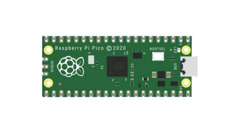
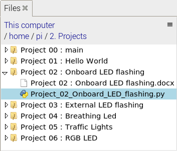
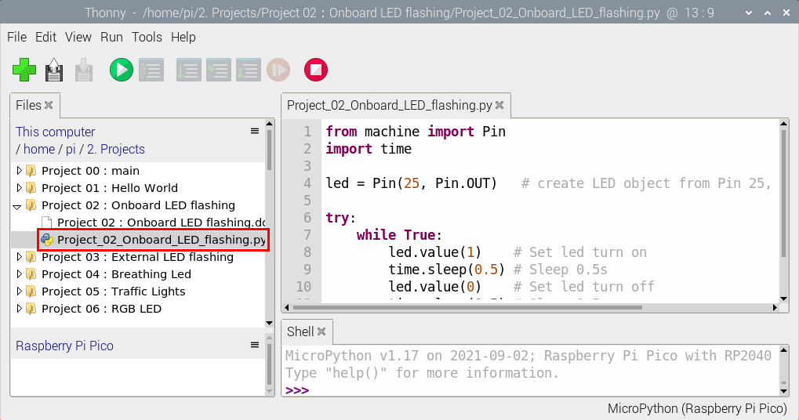
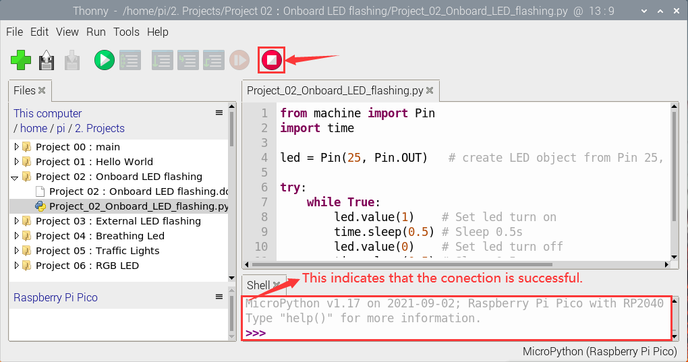
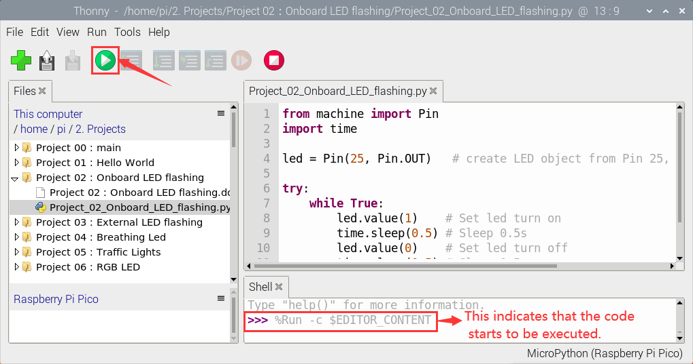
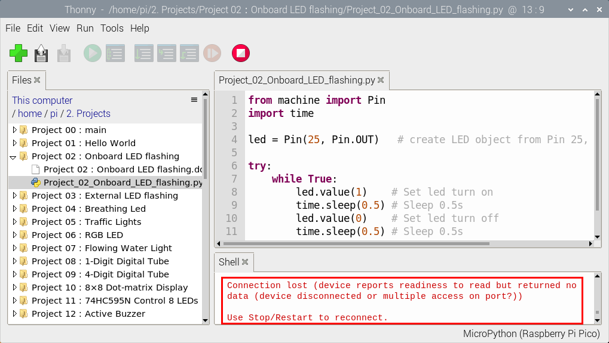
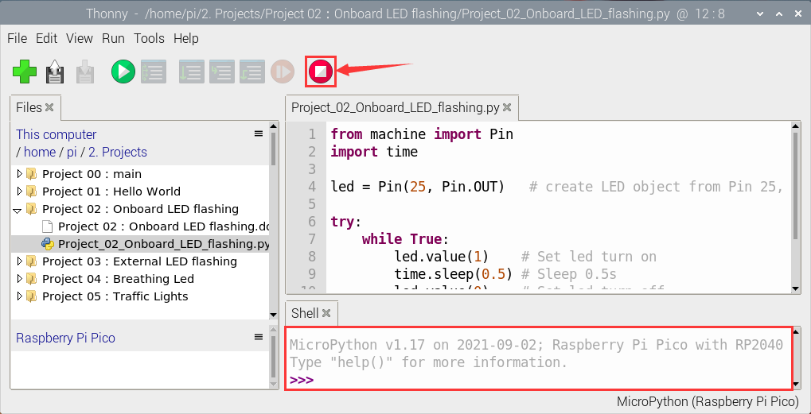
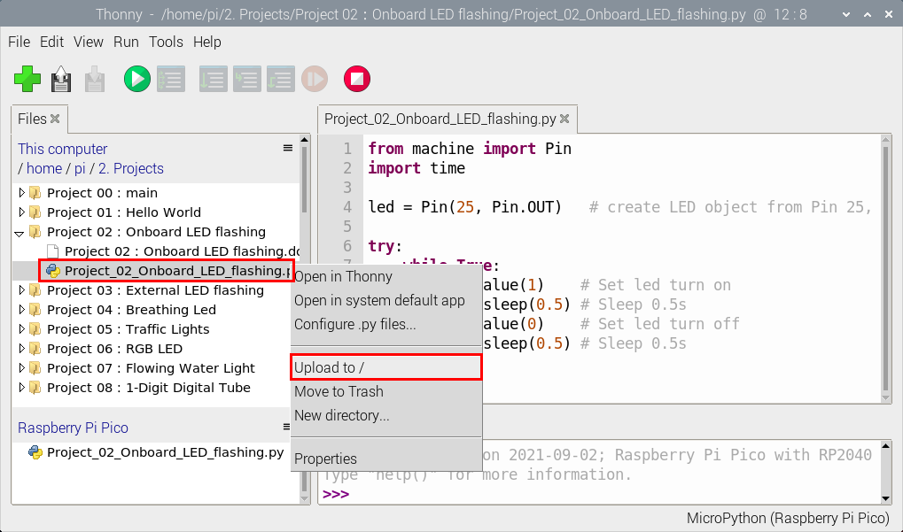
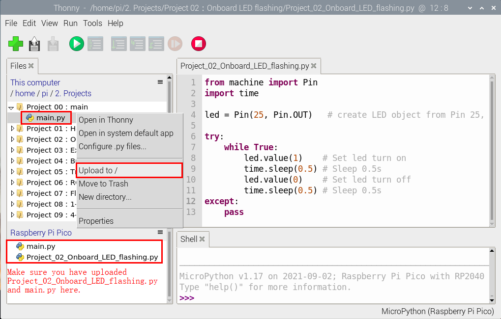
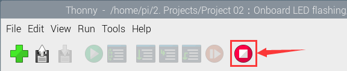

# Project 02: Onboard LED flashing

**1. Description：**

There is an onboard LED in Raspberry Pi Pico,which is a GP25 pin attached to the Raspberry Pi Pico. In this project, we will learn the effect of making the onboard LED blink.

**2. Components**

|  ||
| ------------------------------- | ---------------------- |
| Raspberry Pi Pico\*1            | USB Cable\*1           |

**3. Wiring Up**

In this project, we use a USB cable to connect the Raspberry Pi Pico to the computer.


**4. Test Code**

Go to the folder KS3026 Keyestudio Raspberry Pi Pico Learning Kit Basic Edition\\3. Raspberry Pi System\\Python\_Tutorial\\2. Projects\\Project 02：Onboard LED flashing.

You can move the code anywhere. We save the code to the pi folder of the Raspberry Pi system.

Path:home/pi/2. Projects


Online running

Open“Thonny”, click “This computer”→“home”→“pi”→“2. Projects”→“Project 02：Onboard LED flashing”



Go to the folder Project 02：Onboard LED flashing\<double-click “Project\_02\_Onboard\_LED\_flashing.py”, as shown below;



```python
from machine import Pin
import time

led = Pin(25, Pin.OUT)   # create LED object from Pin 25, Set Pin 25 to output

try:
    while True:
        led.value(1)    # Set led turn on
        time.sleep(0.5) # Sleep 0.5s
        led.value(0)    # Set led turn off
        time.sleep(0.5) # Sleep 0.5s
except:
    pass
```


Connect the pico board to the Raspberry Pi. Click to check the Shell.



Click  to run the code. Then the LED on the pico board will flash; click to exit the program.




Note: This is the code that runs online.  If you disconnect the USB cable and restart Raspberry Pi Pico, the LEDS on Raspberry Pi Pico stop flashing. 

The following information will be displayed in the "Shell" window of Thonny software:  



Code to run offline (upload code to Raspberry Pi Pico) :

Ensure that the Raspberry Pi Pico is connected to the computer and click .  



As shown in the following figure, right-click the file“Project\_02\_Onboard\_LED\_Flashing. py”and choose“Upload to/”to upload the code to Raspberry Pi Pico.  



Upload main.py in the same way.



Disconnect the USB cable from the Raspberry Pi Pico and reconnect, and the Raspberry Pi Pico's LED flashes repeatedly.  


Note: The code here runs offline.  If you want to Stop running offlineand display the information in the “Shell” window, simply click in Thonny software.


