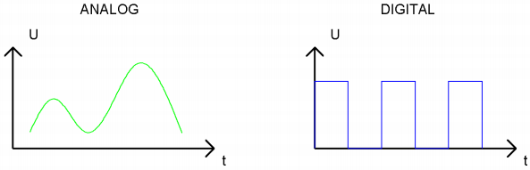
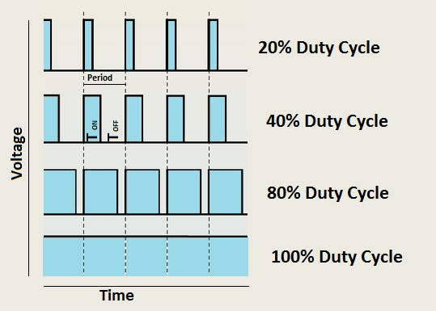

# Project 04: Breathing Led

### **Introduction**

In previous studies, we know that LEDS have on/off state, so how to enter the intermediate state? How to output an intermediate state to make the LED "half bright"? That's what we're going to learn. Breathing lights, or LEDS turn on and off again, which are like "breathing". 

So, how to control the brightness of LEDS? We will use the Raspberry Pi Pico PWM to achieve this goal.  


### **Components**

|  |  |  ||
| ------------------------------------------------------- | ------------------------------------ | ---------------------- | ---------------------- |
| Raspberry Pi Pico\*1                                    | Raspberry Pi Pico Expansion Board\*1 | Breadboard\*1 |                        |
|  ||||
| Red LED\*1                                              | 220Ω Resistance\*1                   | Jumper Wire\*2         | USB Cable\*1           |

### **Knowledge**


**Analog & Digital**

Analog signals are continuous signals in both time and value. By contrast, a digital or discrete time signal is a time series consisting of a series of numbers. 

Most signals in life are analog signals. A familiar example of an analog signal is how temperatures change continuously throughout the day, rather than suddenly changing from 0 to 10 in a flash. However, the value of a digital signal can change instantaneously. 

This change is represented numerically as 1 and 0(the basis of binary code). It's easier to see the difference, as shown below:



In practical applications, we often use a binary as a digital signal, which are a series of 0 and 1. Since binary signals have only two values (0 or 1), they have great stability and reliability. 

Finally, analog and digital signals can be converted to each other. 

**PWM：**

Pulse Width Modulation (PWM) is an effective method to control analog circuit by digital signal. 

Ordinary processors cannot directly output analog signals. The PWM makes this conversion (convert digital signal to analog signal) very convenient, which uses digital pins to send square waves at a certain frequency, which is high and low output to alternate for a period of time. 

The total time of each set of high and low levels is generally fixed, which is called the period (Note: the reciprocal of the period is the frequency). The time of the high level output is usually called pulse width, and the duty cycle is the percentage of the pulse width (PW) to the total period (T) of the waveform. The longer the duration of the high level output as well as the duty cycle is, the higher the corresponding voltage in the analog signal will be. 

The figure below shows the variation of analog signal voltage from 0V to 3.3V(high level is 3.3V) corresponding to pulse width of 0% to 100%.  



We all know that the longer the PWM duty cycle is, the higher the output power will be. Therefore, we can use PWM to control the brightness of LEDS or the speed of dc motors and so on. 

As can be seen from the above, the PWM is not a real analog signal, and the effective value of the voltage is equal to the corresponding analog signal. 

Therefore, we can control the output power of LEDS and other output modules to achieve different effects.

**Raspberry Pi Pico and PWM**

The Raspberry Pi Pico has 16 PWM channels, each of which can control frequency and duty cycle independently. The clock frequency ranges from 7Hz to 125MHz.  Each pin on the Raspberry Pi Pico can be configured for PWM output.  


### **Circuit Diagram and Wiring Diagram**


**Note:**

How to connect the LED


How to identify the 220Ω 5-band resistor


### **Test Code**

The design of this project makes the GP16 output PWM, and the pulse width gradually increases from 0% to 100%, and then gradually decreases from 100% to 0%.  

The code used in this project is saved in the file KS3026 Keyestudio Raspberry Pi Pico Learning Kit Basic Edition\3. Raspberry Pi System\Python_Tutorial\2. Projects\Project 04：Breathing Led. 

You can move the code to anywhere.For example, we save it in the oi folder of the Raspberry Pi system, the route is home/pi/2. Projects.


Open“Thonny, click“This computer”→“home”→“pi”→“2. Projects”→”Project 04: Breathing Led”. And double-click “Project\_04\_Breathing\_Led.py”.


```python
#MicroPython implementation of raspberry PI Pico board LED breathing lamp program example
import time
from machine import Pin,PWM
PWM_PulseWidth=0
#Using external LED, build PWM object PWM LED
pwm_LED=PWM(Pin(16))
#Set the PWM LED frequency
pwm_LED.freq(500)
while True:
    while PWM_PulseWidth<65535:
        PWM_PulseWidth=PWM_PulseWidth+50
        time.sleep_ms(1)   #Delay 1 ms 
        pwm_LED.duty_u16(PWM_PulseWidth)
    while PWM_PulseWidth>0:
        PWM_PulseWidth=PWM_PulseWidth-50
        time.sleep_ms(1)
        pwm_LED.duty_u16(PWM_PulseWidth)
```


### **Test Result：**

Connect the pico board to the Raspberry Pi. Clickto check the Shell


Click  to run the code. Then the LED on the picoboard will flash; click to exit the program.


