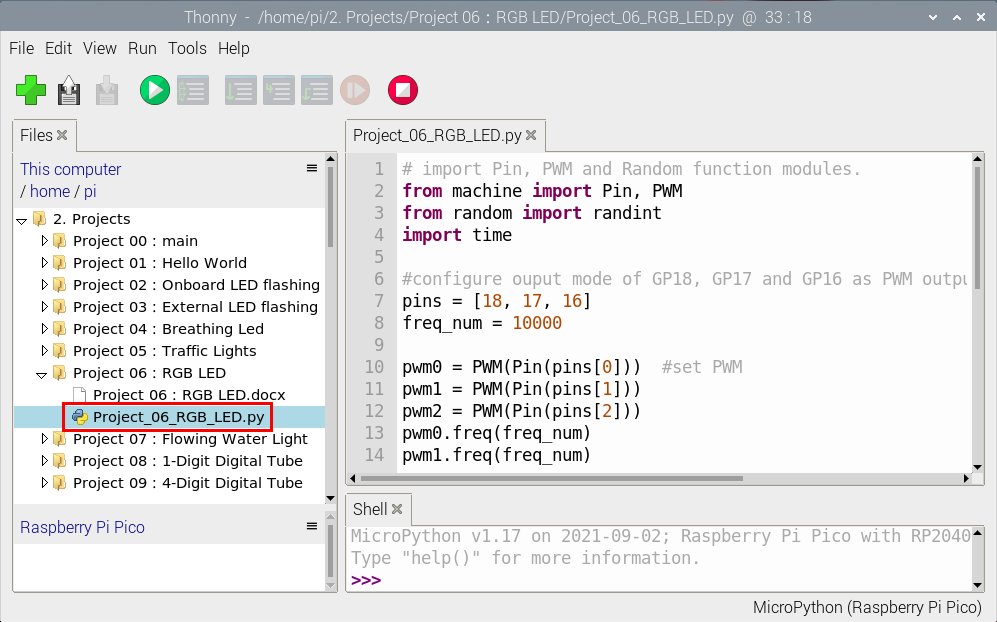
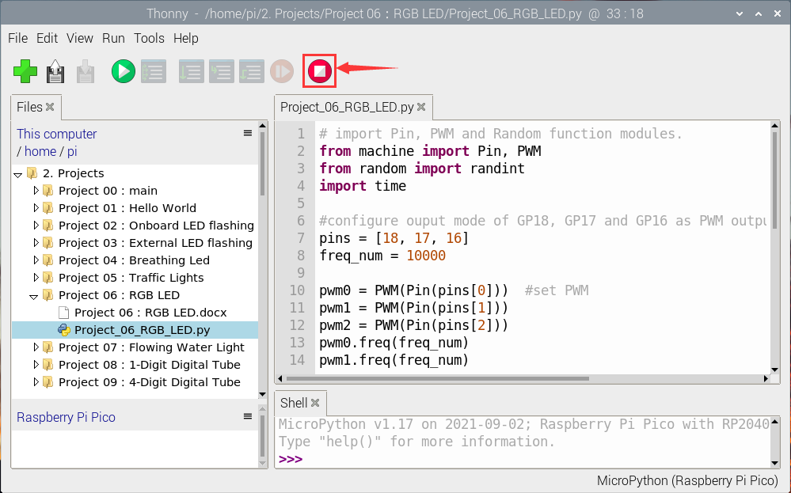
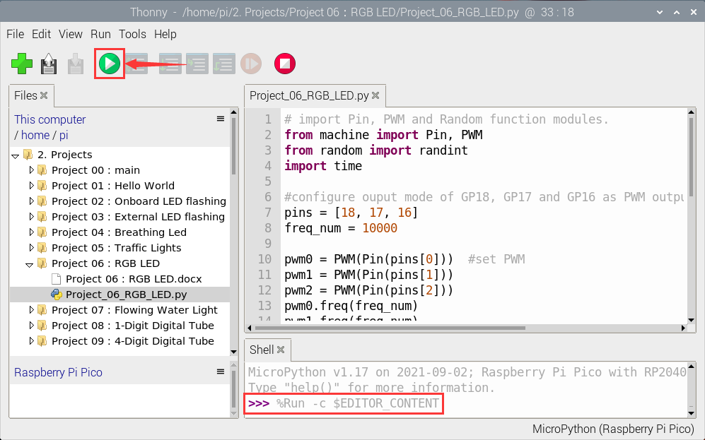

# Project 06: RGB LED

**Introduction**


RGB LEDS are made up of three colors (red, green, and blue) , which can emit different colors by mixing these three basic colors. 

In this project, we will introduce the RGB LED and show you how to use the Raspberry Pi Pico to control the RGB LED. Even though RGB LED is very basic, it is also a great way to learn the fundamentals of electronics and coding.

**Components Required**

|  |  |||
| ------------------------------------------------------- | ------------------------------------ | ------------------------------- | ---------------------- |
| Raspberry Pi Pico\*1                                    | Raspberry Pi Pico Expansion Board\*1 | RGB LED\*1                      |                        |
|  ||||
| 220ΩResistor\*3                                         | Breadboard\*1                        | Jumper Wires                    | USB Cable\*1           |


**Component Knowledge**

The monitors mostly adopt the RGB color standard, and all the colors on the computer screen are composed of the three colors of red, green and blue mixed in different proportions.


This RGB LED has 4 pins and a common cathode. To change its brightness, we can use the PWM of the Raspberry Pi Pico pins, which can give different duty cycle signals to the RGB LED to produce different colors.

If we use three 10-bit PWM to control the RGBLED, theoretically we can create 210\*210\*210= 1,073,741,824(1 billion) colors through different combinations.


**Circuit Diagram and Wiring Diagram**


**Note:**

RGB LED longest pin (common cathode) connected to GND.


How to identify the 220Ω 5-band resistor


**Test Code**

The code used in this project is saved in the file KS3026 Keyestudio Raspberry Pi Pico Learning Kit Basic Edition\\3.Raspberry Pi System\\Python\_Tutorial\\2. Projects\\Project 06：RGB LED. You can move the code to anywhere.For example, we can save the pi folder of the Raspberry Pi System, the route is home/pi/2. Projects


Open“Thonny, click“This computer”→“home”→“pi”→“2. Projects”→“Project 06：RGB LED”and double left-click the“Project\_06\_RGB\_LED.py”.



```python
# import Pin, PWM and Random function modules.
from machine import Pin, PWM
from random import randint
import time

#configure ouput mode of GP18, GP17 and GP16 as PWM output and PWM frequency as 10000Hz.
pins = [18, 17, 16]
freq_num = 10000

pwm0 = PWM(Pin(pins[0]))  #set PWM
pwm1 = PWM(Pin(pins[1]))
pwm2 = PWM(Pin(pins[2]))
pwm0.freq(freq_num)
pwm1.freq(freq_num)
pwm2.freq(freq_num)

#define a function to set the color of RGBLED.
def setColor(r, g, b):
    pwm0.duty_u16(65535 - r)
    pwm1.duty_u16(65535 - g)
    pwm2.duty_u16(65535 - b)
    
try:
    while True:
        red   = randint(0, 65535) 
        green = randint(0, 65535)
        blue  = randint(0, 65535)
        setColor(red, green, blue)
        time.sleep_ms(200)
except:
    pwm0.deinit()
    pwm1.deinit()
    pwm2.deinit() 
```


**Test Result**

Ensure that the Raspberry Pi Pico is connected to the computer, click “Stop/Restart backend”.



Click “Run current script”, the code starts executing, we will see that RGB LED starts showing random colors.

Press“Ctrl+C”or click“Stop/Restart backend”to exit the program.


