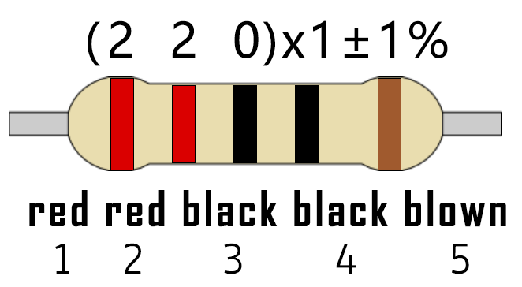

# Project 07: Flowing Water Light

### **Introduction**

In our daily life, we can see many billboards made up of different colors of LED. 

They constantly change the light to attract the attention of customers. In this project, we will use Raspberry Pi Pico to control 10 LEDs to achieve the effect of flowing water.

### **Components Required**

|  |              |  |                         |
| ----------------------- | ----------------------------------- | ----------------------- | ----------------------- |
| Raspberry Pi Pico*1     | Raspberry Pi Pico Expansion Board*1 | Red LED*10              |                         |
|  |              |  |  |
| 220ΩResistor*10         | Breadboard*1                        | Jumper Wires            | USB Cable*1             |


### **Circuit Diagram and Wiring Diagram**


**Note:**

How to connect the LED


How to identify the 220Ω 5-band resistor



### **Test Code**

This project is to design and manufacture a flowing water light.  

Here are the steps: 

1. turn on LED \#1, then turn it off.  
2. turn on LED \#2, then turn off... . Do the same for the 10 LEDs until the last one is turned off.  
3. repeating the process to achieve the "movement" of the water.

The code used in this project is saved in the file KS3026 Keyestudio Raspberry Pi Pico Learning Kit Basic Edition\\3. Raspberry Pi System\\Python\_Tutorial\\2. Projects\\Project 07：Flowing Water Light.

You can move the code to anywhere.For example, we save it in the oi folder of the Raspberry Pi system, the route is home/pi/2. Projects.


Open“Thonny, click“This computer”→“home”→“pi”→“2. Projects”→”Project 07：Flowing Water Light”and double-click“Project\_07\_Flowing\_Water\_Light.py”


```python
from machine import Pin
import time

#Use an array to define 10 GPIO ports connected to LED Bar Graph for easier operation.
pins = [16, 17, 18, 19, 20, 21, 22, 26, 27, 28]
#Use two for loops to turn on LEDs separately from left to right and then back from right to left
def showLed():
    for pin in pins:
        print(pin)
        led = Pin(pin, Pin.OUT)
        led.value(1)
        time.sleep_ms(100)
        led.value(0)
        time.sleep_ms(100)        
    for pin in reversed(pins):
        print(pin)
        led = Pin(pin, Pin.OUT)
        led.value(1)
        time.sleep_ms(100)
        led.value(0)
        time.sleep_ms(100)
          
while True:
    showLed()
```


### **Test Result：**

Connect the pico board to the Raspberry Pi. Click to check the Shell


Click “Run current script”, the code starts executing, we will see that the 10 LEDs will light up like a flowing light. 

Click “Stop/Restart backend”to exit the program.


