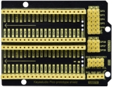

# Project 08: 1-Digit Digital Tube

### **Introduction**

The seven-segment digital tube is an electronic display device that displays decimal numbers. It is widely used in digital clocks, electronic meters, basic calculators and other electronic devices that display digital information. 

The tubes are an alternative to more complex dot-matrix displays that are easy to use in both limited light conditions and strong sunlight. 

In this project, we will use the Raspberry Pi Pico to control 1-digit digital tube to display numbers.


### **Components Required**

|  |              |  |                         |
| ----------------------- | ----------------------------------- | ----------------------- | ----------------------- |
| Raspberry Pi Pico*1     | Raspberry Pi Pico Expansion Board*1 | 1-digit Digital Tube*1  |                         |
|  |              |  |  |
| 220ΩResistor*8          | Breadboard*1                        | BreadboardWires         | USB Cable*1             |


### **Component Knowledge**


**Display principle:** 

The digital tube display is a semiconductor light-emitting device.  Its basic unit is a light-emitting diode (LED). The digital tube display can be divided into 7-segment digital tube and 8-segment digital tube according to the number of segments. The 8-segment digital tube has one more LED unit than the 7-segment digital tube (used for decimal point display). Each segment of the 7-segment LED display is a separate LED. According to the connection mode of the LED unit, the digital tube can be divided into a common anode digital tube and a common cathode digital tube.

In the common cathode 7-segment digital tube, all the cathodes (or negative electrodes) of the segmented LEDs are connected together, so you should connect the common cathode to GND. To light up a segmented LED, you can set its associated pin to “HIGH”.

In the common anode 7-segment digital tube, the LED anodes (positive electrodes) of all segments are connected together, so you should connect the common anode to “+5V”. To light up a segmented LED, you can set its associated pin to “LOW”.


Each part of the digital tube is composed of an LED. So when you use it, you also need to use a current limiting resistor. Otherwise, the LED will be damaged. 

In this experiment, we use an ordinary common cathode one-bit digital tube. As we mentioned above, you should connect the common cathode to GND. To light up a segmented LED, you can set its associated pin to “HIGH”.


### **Circuit Diagram and Wiring Diagram**


**Note:** 

The direction of the 7-segment digital tube inserted into the breadboard is the same as the wiring diagram, and there is one more point in the lower right corner.


### **Test Code**

The digital display is divided into 7 segments, and the decimal point display is divided into 1 segment. When certain numbers are displayed, the corresponding segment will be illuminated. For example, when the number 1 is displayed, segments b and c will be opened.

The code used in this project is saved in the file KS3026 Keyestudio Raspberry Pi Pico Learning Kit Basic Edition\3. Raspberry Pi System\Python_Tutorial\2. Projects\Project 08：1-Digit Digital Tube. 

You can move the code to anywhere. For example, we save it in the oi folder of the Raspberry Pi system, the route is home/pi/2. Projects.


Open“Thonny”, click“This computer”→“home”→“pi”→“2. Projects”→”Project 08：1-Digit Digital Tube”and double-click “Project\_08\_One\_Digit\_Digital\_Tube.py”.


```python
from machine import Pin
import time

a = machine.Pin(17, machine.Pin.OUT)
b = machine.Pin(16, machine.Pin.OUT)
c = machine.Pin(14, machine.Pin.OUT)
d = machine.Pin(13, machine.Pin.OUT)
e = machine.Pin(12, machine.Pin.OUT)
f = machine.Pin(18, machine.Pin.OUT)
g = machine.Pin(19, machine.Pin.OUT)
dp = machine.Pin(15, machine.Pin.OUT)

pins = [machine.Pin(id,machine.Pin.OUT) for id in [17, 16, 14, 13, 12, 18, 19, 15]]

def show(code):
    for i in range(0, 8):
        pins[i].value(~code & 1)
        code = code >> 1

#Select code from 0 to 9
mask_digits = [0xc0, 0xf9, 0xa4, 0xb0, 0x99, 0x92, 0x82, 0xf8,0x80, 0x90]
for code in reversed(mask_digits):
    show(code)
    time.sleep(1)
```


### **Test Result：**

Connect the pico board to the Raspberry Pi. Click to check the Shell


Click  to run the code. Then we will see that the 1-digit digital tube will display numbers from 9 to 0; click to exit the program.


