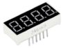
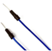
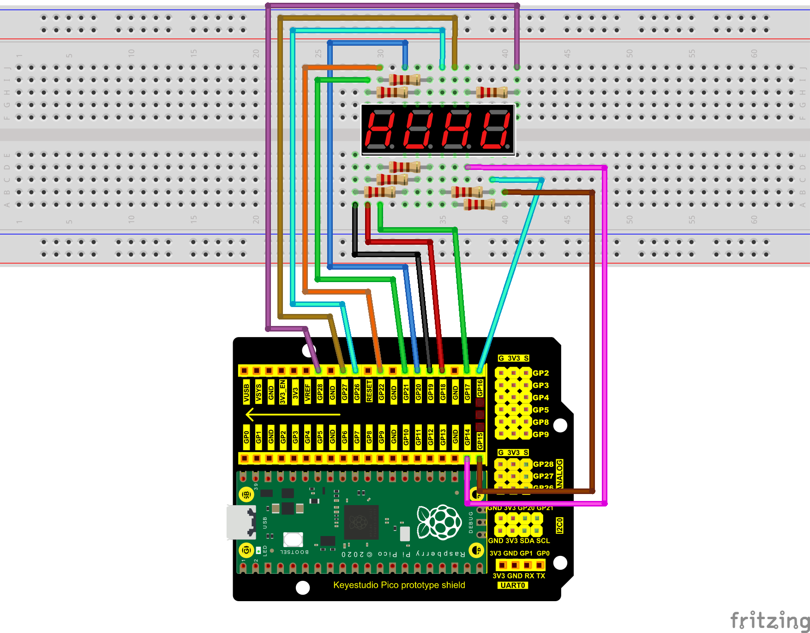
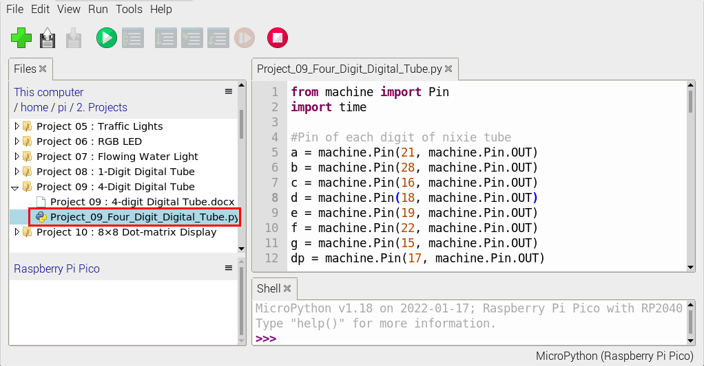
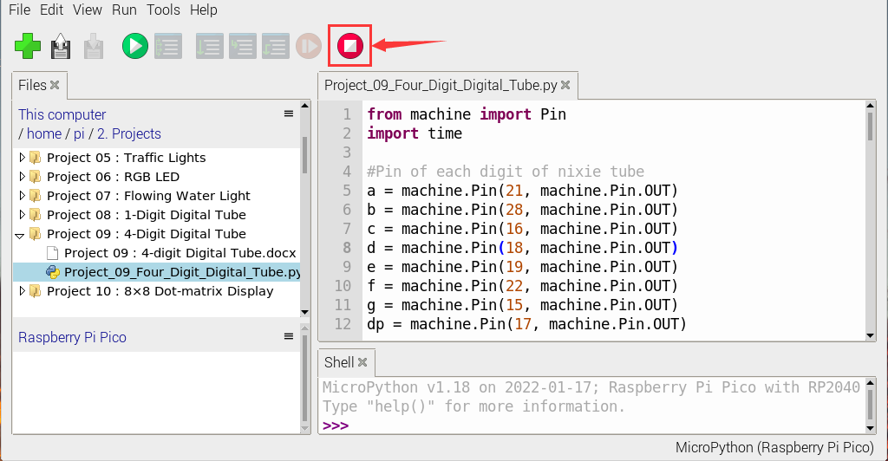
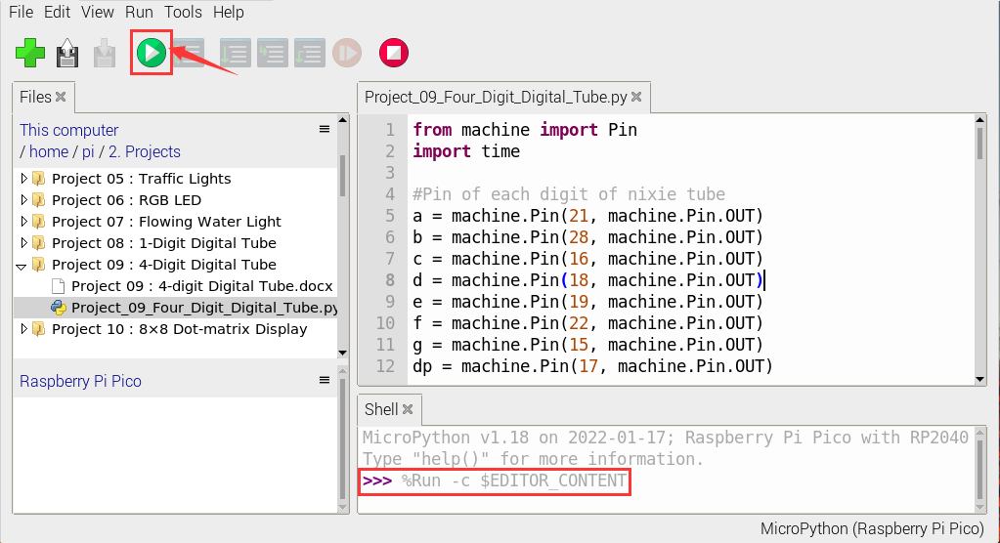

# Project 09：4-Digit Digital Tube

### **Introduction**

The 4-digit 7-segment digital tube is a very practical display device, and it is used for devices such as electronic clocks and score counters. Due to the low price and it is easy to use, more and more projects will use 4-digit 7-segment digital tubes. 

In this project, we will use the Raspberry Pi Pico to control a 4-bit 7-segment digital tube to create a manual counter.


### **Components Required**

|  |  |||
| ------------------------------------------------------- | ------------------------------------ | ---------------------- | ---------------------- |
| Raspberry Pi Pico\*1                                    | Raspberry Pi Pico Expansion Board\*1 | 220Ω Resistor\*8       |                        |
|  ||||
| 4-Digit Digital Tube Module\*1                          | Jumper Wires                         | USB Cable\*1           | Breadboard\*1          |


### **Component Knowledge**


**Four-digit digital tube**: 

The four-digit digital tube has two types of four-digit digital tubes: a common anode and a common cathode. 

The display principle is similar to that of a one-digit digital tube. They are all 8 GPIO ports to control the display segment of the digital tube, that is, 8 LED lights, however, here are 4 bits, so 4 GPIO ports are needed to control the bit selection terminal, that is, to choose which single digital tube is on, the bit switching is very fast, and the naked eye can't distinguish it. A digital tube is displayed at the same time. It is common cathode.

G1, G2, G3 and G4 are pins of control bit.


**Schematic Diagram**


### **Circuit Diagram and Wiring Diagram**




### **Test Code**

The code used in this project is saved in the file KS3026 Keyestudio Raspberry Pi Pico Learning Kit Basic Edition\3. Raspberry Pi System\Python_Tutorial\2. Projects\Project 09：4-Digit Digital Tube. 

You can move the code to anywhere.For example, we save it in the oi folder of the Raspberry Pi system, the route is home/pi/2. Projects.


Open“Thonny”, click“This computer”→“home”→“pi”→“2. Projects”→“Project 09：4-Digit Digital Tube” .



```python
from machine import Pin
import time

#Pin of each digit of nixie tube
a = machine.Pin(21, machine.Pin.OUT)
b = machine.Pin(28, machine.Pin.OUT)
c = machine.Pin(16, machine.Pin.OUT)
d = machine.Pin(18, machine.Pin.OUT)
e = machine.Pin(19, machine.Pin.OUT)
f = machine.Pin(22, machine.Pin.OUT)
g = machine.Pin(15, machine.Pin.OUT)
dp = machine.Pin(17, machine.Pin.OUT)

G1 = machine.Pin(20, machine.Pin.OUT)
G2 = machine.Pin(26, machine.Pin.OUT)
G3 = machine.Pin(27, machine.Pin.OUT)
G4 = machine.Pin(14, machine.Pin.OUT)
 
#digital tube a to dp corresponding development board pins
d_Pins=[machine.Pin(i,machine.Pin.OUT)  for i in [21,28,16,18,19,22,15,17]]
#Pin corresponding to digital tube segment G1, G2, G3, and G4
w_Pins=[machine.Pin(i,machine.Pin.OUT)  for i in [20,26,27,14]]
 
number={
    '0':
    [1,1,1,1,1,1,0,0],#0
    '1':
    [0,1,1,0,0,0,0,0],#1
    '2':
    [1,1,0,1,1,0,1,0],#2
    '3':
    [1,1,1,1,0,0,1,0],#3
    '4':
    [0,1,1,0,0,1,1,0],#4
    '5':
    [1,0,1,1,0,1,1,0],#5
    '6':
    [1,0,1,1,1,1,1,0],#6
    '7':
    [1,1,1,0,0,0,0,0],#7
    '8':
    [1,1,1,1,1,1,1,0],#8
    '9':
    [1,1,1,1,0,1,1,0],#9
}
 
def display(num,dp):
    global number
    count=0
    for pin in d_Pins:#displays the value of num 
        pin.value(number[num][count])
        count+=1
    if dp==1:
        d_Pins[7].value(0)
def clear():
    for i in w_Pins:
        i.value(0)
    for i in d_Pins:
        i.value(1)
def showData(num):
   #the hundreds, thousands, ones, and fractional values of a numeric value
    d_num=num
    location=d_num.find('.')
    if location>0:
        d_num=d_num.replace('.','')
        while len(d_num)<4:
            d_num='0'+d_num
        for i in range(0,4):
            time.sleep(2)
            clear()
            w_Pins[3-i].value(1)
            if i==location-1:
                display(d_num[i],1)
            else:
                display(d_num[i],0)
    if location<0:
        for i in range(0,4):
            time.sleep(2)
            clear()
            w_Pins[3-i].value(1)
            display(d_num[i],0)
while True:
 
    num='9016'
showData(num)
```


### **Test Result：**

Connect the pico board to the Raspberry Pi. Click to check the Shell



Click “”, the code starts executing, we will see that the 4-digit digital tube circularly displays numbers from 0000 to 9999. 

Click“”to exit the program.


