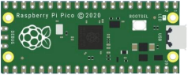
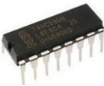
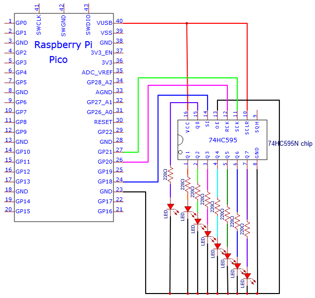
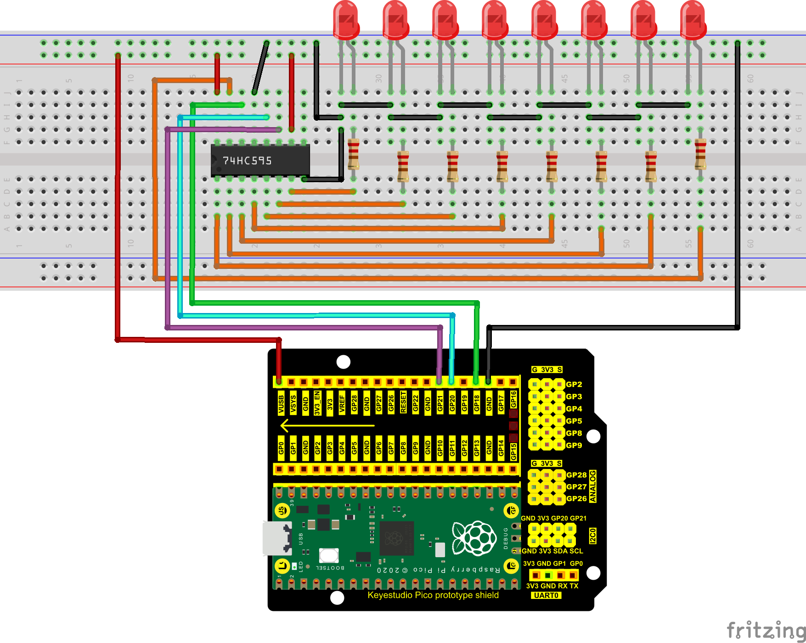
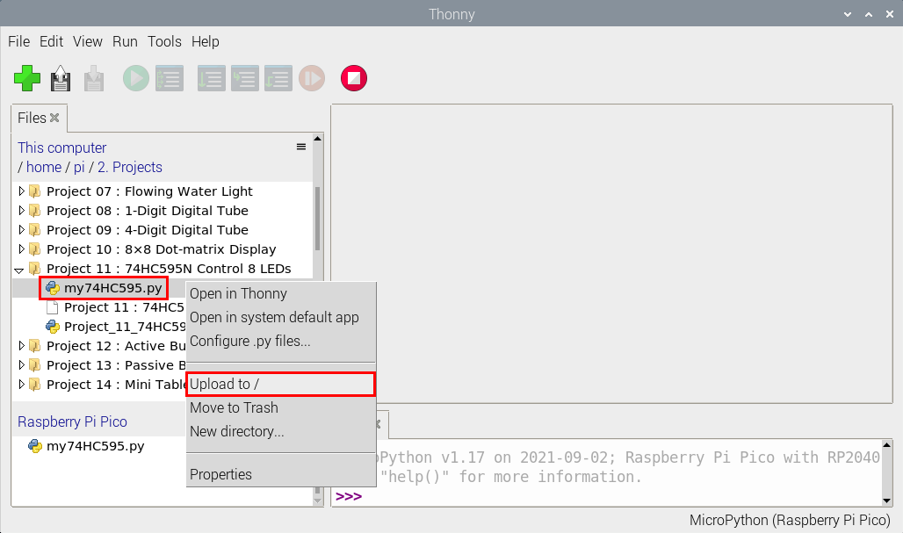
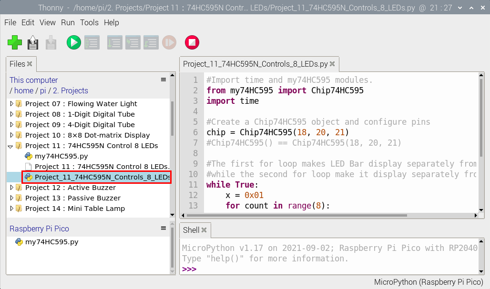
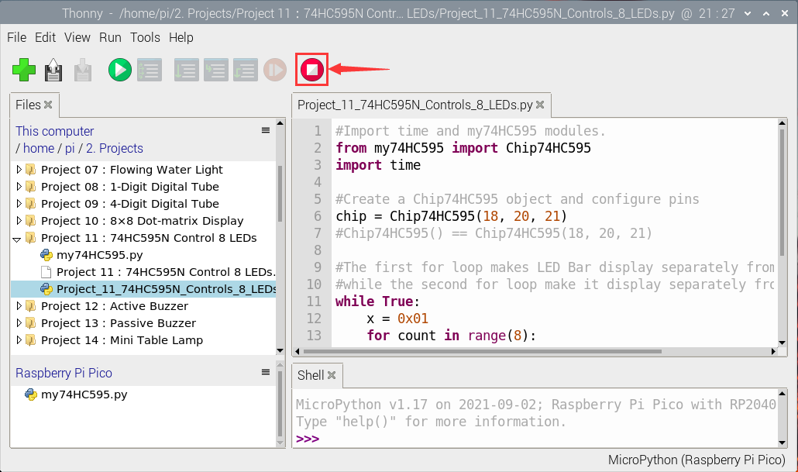
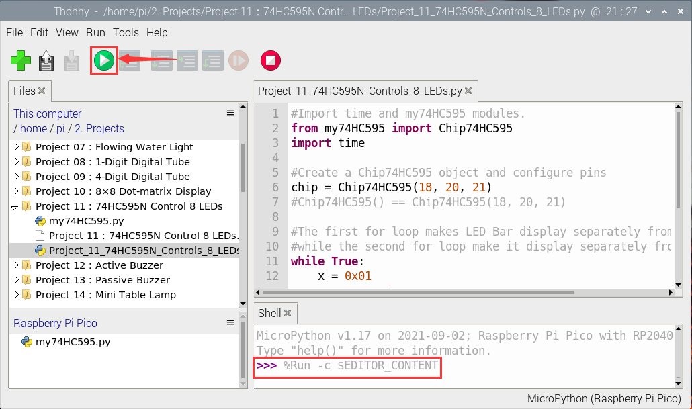

# Project 11：74HC595N Control 8 LEDs 

**Introduction**

In previous projects, we have learned how to light an LED.  However, how to light up a lot of LEDs with only 26 I/O ports on the Raspberry Pi Pico? Sometimes we may run out of pins, at that time, we need to extend it with the shift register. You can use a 74HC595N chip to control up to eight outputs at a time, using only a few pins on your microcontroller. 

In addition, You can also connect multiple registers together to further expand the output. In this project, we will use a Raspberry Pi Pico, a 74HC595 chip and LEDs to make a flowing water light to understand the function of the chip.  

**Components Required**

|  ||||
| ------------------------------------------------------- | ------------------------------------ | ---------------------- | --------------------------- |
| Raspberry Pi Pico\*1                                    | Raspberry Pi Pico Expansion Board\*1 | 74HC595N Chip\*1       | Red LED\*8                  |
|  ||||
| 220ΩResistor\*8                                         | Breadboard\*1                        | Jumper Wires           | USB Cable\*1                |

**Component Knowledge**


**74HC595N Chip:** 

To put it simply, 74HC595N chip is a combination of 8-digit shifting register, memorizer and equipped with tri-state output. The shift register and the memorizer are synchronized to different clocks, and the data is input on the rising edge of the shift register clock SCK and goes into the memory register on the rising edge of the memory register clock RCK. If the two clocks are connected together, the shift register is always one pulse earlier than the storage register. 

The shift register has a serial shift input (SI) and a serial output (SQH) for cascading. The 8-bit shift register can be reset asynchronously (low-level reset), and the storage register has an 8-bit Three-state parallel bus output, when the output enable (OE) is enabled (active low), the storage register is output to the 74HC595N pin (bus).


**Pins**：

|             PIN              | FUNCTION                                                     |
| :--------------------------: | ------------------------------------------------------------ |
|           Pin13 OE           | It is an output enable pin to ensure that the data of the latch is input to the Q0 to Q7 pins or not. <br />When it is low, no high level is output. <br />In this experiment, we directly connect to GND and keep the data output low. |
|           Pin14 SI           | This is the pin for 74HC595 to receive data, i.e. serial data input, only one bit can be input at a time, <br />then 8 times in a row, it can form a byte. |
|          Pin10 SCLR          | A pin to initialize the storage register pins. It initializes the internal storage registers at a low level. <br />In this experiment, we connect VCC to maintain a high level. |
|          Pin11 SCK           | The clock pin of the shift register. <br />At the rising edge, the data in the shift register is shifted backward as a whole, <br />and new data input is received. |
|          Pin12 RCK           | The clock input pin of the storage register . <br />At the rising edge, the data is transferred from the shift register to the storage register. <br />At this time, the data is output in parallel from the Q0 to Q7 ports. |
|           Pin9 SQH           | It is a serial output pin dedicated for chip cascading to the SI terminal of the next 74HC595. |
| Q0--Q7<br />(Pin 15, Pin1-7) | Eight-bit parallel output, can directly control the 8 segments of the digital tube. |


**Circuit Diagram and Wiring Diagram**



Note: Pay attention to the direction in which the 74HC595N chip is inserted.




**Test Code**

Open“Thonny”, click“This computer”→“home”→“pi”→“2. Projects”→“Project 11：74HC595N Control 8 LEDs”. 

Select“my74HC595.py”, right-click and select“Upload to /”，wait for“my74HC595.py”to be uploaded to the Raspberry Pi Pico. And double-click the“Project_11_74HC595N_Controls_8_LEDs.py”.


Open “Thonny”, click“This computer”→“home”→“pi”→“2. Projects”→“Project 11：74HC595N Control 8 LEDs”. 

Select“my74HC595.py”, right-click and select“Upload to /”，wait for“my74HC595.py”to be uploaded to the Raspberry Pi Pico. 

Click the“Project\_11\_74HC595N\_Controls\_8\_LEDs.py”.





```python
#Import time and my74HC595 modules.
from my74HC595 import Chip74HC595
import time

#Create a Chip74HC595 object and configure pins
chip = Chip74HC595(18, 20, 21)
#Chip74HC595() == Chip74HC595(18, 20, 21)

#The first for loop makes LED Bar display separately from left to right
#while the second for loop make it display separately from right to left.
while True:
    x = 0x01
    for count in range(8):
        chip.shiftOut(1, x)
        x = x<<1;
        time.sleep_ms(300)
    x = 0x01
    for count in range(8):
        chip.shiftOut(0, x)
        x = x<<1
        time.sleep_ms(300)
```


**Test Result**

Ensure that the Raspberry Pi Pico is connected to the computer，click“Stop/Restart backend”.



Click “Run current script”, the code starts executing, we will see that the 8 LEDs start flashing in flowing water mode. 

Press “Ctrl+C”or click“Stop/Restart backend”to exit the program.


