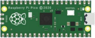
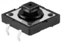
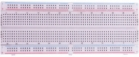
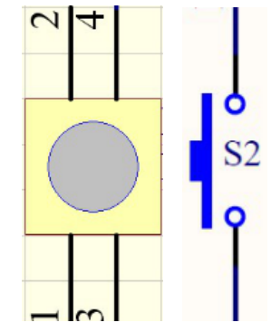
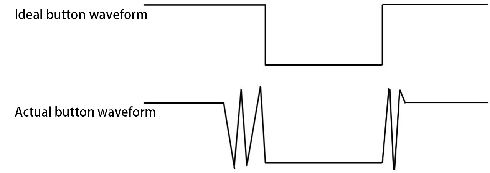
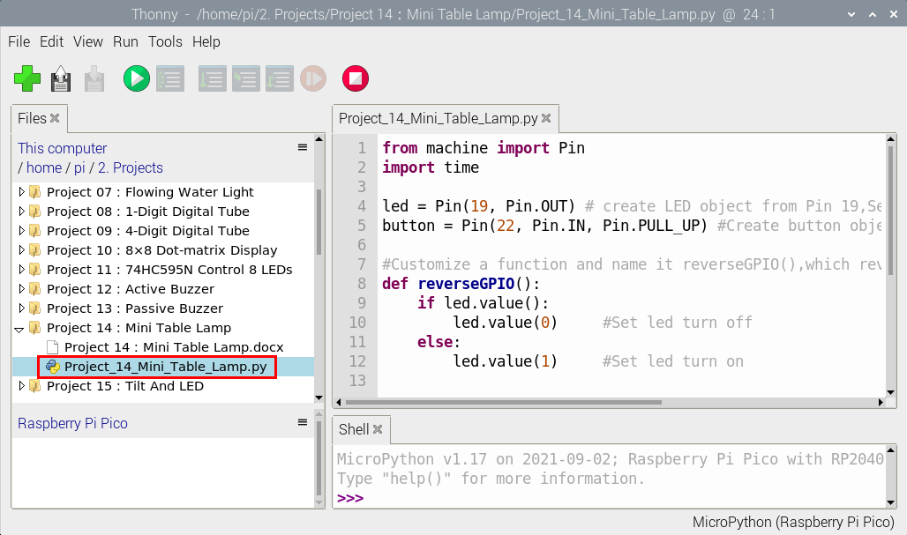
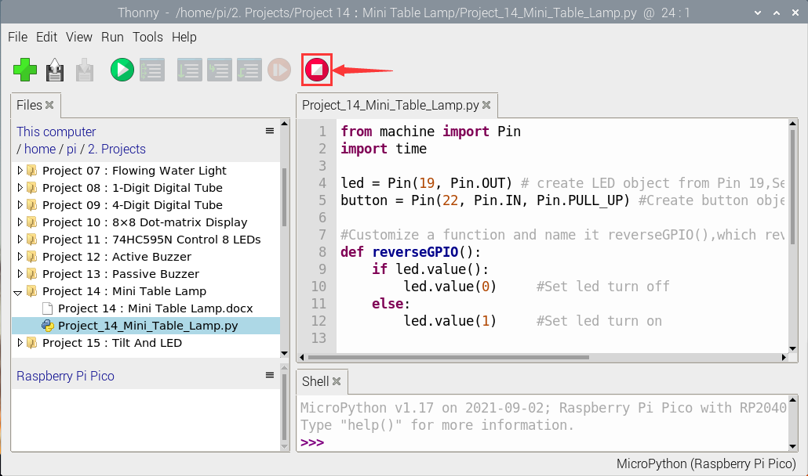
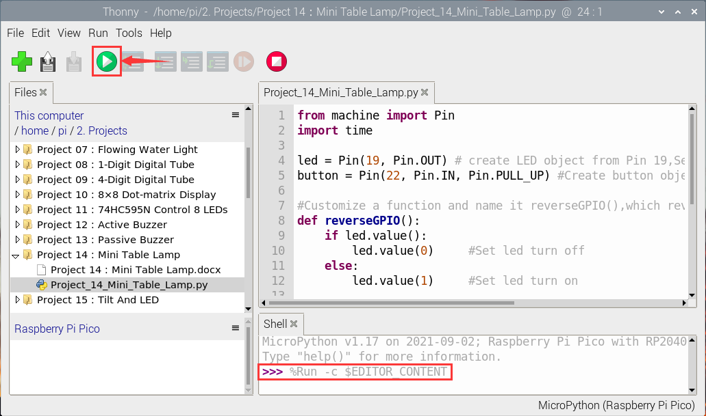

# Project 14 : Mini Table Lamp

### **Introduction**

Did you know that a Raspberry Pi Pico can light up an LED when you press a button? In this project, we will use the Raspberry Pi Pico, a key switch and an LED to make a Mini Table lamp.

### **Components Required**

|                  |  |  |  |  |
| --------------------------------------- | -------------------------------------- | --------------------------------------- | --------------------------------------- | --------------------------------------- |
| Raspberry Pi Pico*1                     | Raspberry Pi Pico Expansion Board*1    | Button*1                                | Red LED*1                               | 10KΩResistor*1                          |
|  |                 |  |  |  |
| Breadboard*1                            | 220ΩResistor*1                         | USB Cable*1                             | JumperWires                             | Button Cap*1                            |

### **Component Knowledge**


**Button:** 

The button can control the circuit on and off. The circuit is disconnected when the button is not pressed. But it breaks when you release it. Why does it only work when you press it? It starts from the internal structure of the button, which is shown in the figure:


Before the button is pressed, 1 and 2 are on, 3 and 4 are also on, but 1, 3 or 1, 4 or 2, 3 or 2, 4 are off (not working). Only when the button is pressed, 1, 3 or 1, 4 or 2, 3 or 2, 4 are on. The key switch is one of the most commonly used components in circuit design.

**Schematic diagram of the button:**



**What is button jitter?**

We think of the switch circuit as "press the button and turn it on immediately", "press it again and turn it off immediately". In fact, this is not the case.

The button usually uses a mechanical elastic switch, and the mechanical elastic switch will produce a series of jitter due to the elastic action at the moment when the mechanical contact is opened and closed (usually about 10ms). 

As a result, the button switch will not immediately and stably turn on the circuit when it is closed, and it will not be completely and instantaneously disconnected when it is turned off. 



**How to eliminate the jitter?**

There are two common methods, namely fix jitter in the software and hardware. We only discuss the jitter removal in the software.

We already know that the jitter time generated by elasticity is about 10ms, and the delay command can be used to delay the execution time of the command to achieve the effect of jitter removal.

Therefore, we delay 0.02s in the code to achieve the key anti-shake function.


### **Circuit Diagram and Wiring Diagram**


**Note:**

How to connect the LED


How to identify the 220Ω 5-band resistor and 10KΩ 5-band resistor


### Test Code

The code used in this project is saved in the file KS3026 Keyestudio Raspberry Pi Pico Learning Kit Basic Edition\3.Raspberry Pi System\Python_Tutorial\2. Projects\Project 14：Mini Table Lamp. 

You can move the code anywhere. We save the code to the pi folder of the Raspberry Pi system. The path: home/pi/2. Projects


Open “Thonny”, click“This computer”→“home”→“pi”→“2. Projects”→“Project 14：Mini Table Lamp”. And double-click the“Project\_14\_Mini\_Table\_Lamp.py”.



```python
from machine import Pin
import time

led = Pin(19, Pin.OUT) # create LED object from Pin 19,Set Pin 19 to output                   
button = Pin(22, Pin.IN, Pin.PULL_UP) #Create button object from Pin22,Set GP22 to input

#Customize a function and name it reverseGPIO(),which reverses the output level of the LED
def reverseGPIO():
    if led.value():
        led.value(0)     #Set led turn off
    else:
        led.value(1)     #Set led turn on

try:
    while True:
        if not button.value():
            time.sleep_ms(20)
            if not button.value():
                reverseGPIO()
                while not button.value():
                    time.sleep_ms(20)
except:
    pass
```


### **Test Result**

Ensure that the Raspberry Pi Pico is connected to the computer，click“Stop/Restart backend”.



Click“Run current script”, the code starts executing, we will see that press the button, the LED lights up;  when the button is released, the LED remains lit.  

Press the button again, the LED goes off;  When the button is released, the LED remains off. Doesn't it look like a little lamp? 

Click “Stop/Restart backend”to exit the program.


