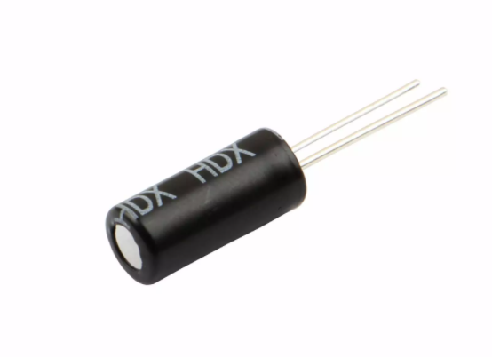
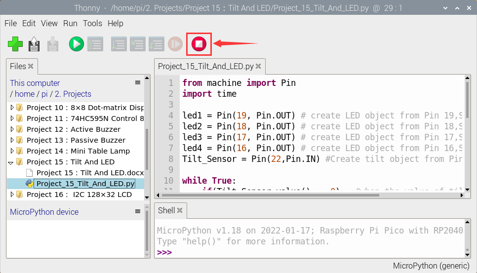

# Project 15：Tilt And LED

### **Introduction**

The ancients without electronic clocks, so the hourglass are invented to measure time. The hourglass has a large capacity on both sides, and which is filled with fine sand on one side. What’s more, there is a small channel in the middle, which can make the hourglass stand upright , the side with fine sand is on the top. 

However, due to the action of gravity, the fine sand will flow down through the channel to the other side of the hourglass. When the sand reaches the bottom, turn it upside down and record the number of times it has gone through the hourglass, therefore, the next day we can know the approximate time of the day by it. In this project, we will use a Raspberry Pi Pico to control the tilt switch and LED lights to simulate an hourglass and make an electronic hourglass. 

### **Components Required**

|  |  |  |  |  |
| -------------------------------------- | -------------------------------------- | -------------------------------------- | -------------------------------------- | -------------------------------------- |
| Raspberry Pi Pico*1                    | Raspberry Pi Pico Expansion Board*1    | Tilt Switch*1                          | Red LED*4                              | 10KΩResistor*1                         |
|  |  |  |  |                                        |
| Breadboard*1                           | 220ΩResistor*4                         | USB Cable*1                            | Jumper Wires                           |                                        |

### **Component Knowledge**



Tilt switch is also called digital switch. Inside is a metal ball that can roll. The principle of rolling the metal ball to contact with the conductive plate at the bottom, which is used to control the on and off of the circuit. When it is a rolling ball tilt sensing switch with single directional trigger, the tilt sensor is tilted toward the trigger end (two gold-plated pin ends), the tilt switch is in a closed circuit and the voltage at the analog port is about 5V (binary number is 1023). 

In this way, the LED will light up. When the tilt switch is in a horizontal position or tilted to the other end, it is open and the voltage of the analog port is about 0V (binary number is 0), the LED will turn off. 

In the program, we judge the state of the switch based on whether the voltage value of the analog port is greater than 2.5V (binary number is 512).

As shown in the figure, use the internal structure of the tilt switch to illustrate how it works.


### **Circuit Diagram and Wiring Diagram**


Note:

How to connect the LED


How to identify the 220Ω 5-band resistor and 10KΩ 5-band resistor


### **Test Code**

The code used in this project is saved in the file KS3026 Keyestudio Raspberry Pi Pico Learning Kit Basic Edition\3. Raspberry Pi System\Python_Tutorial\2. Projects\Project 15：Tilt And LED. 

You can move the code anywhere. We save the code to the pi folder of the Raspberry Pi system. The path:home/pi/2. Projects


Open“Thonny”, click“This computer”→“home”→“pi”→“2. Projects”→“Project 15：Tilt And LED. And double-click the “Project\_15\_Tilt\_And\_LED.py”.


```python
from machine import Pin
import time

led1 = Pin(19, Pin.OUT) # create LED object from Pin 19,Set Pin 19 to output
led2 = Pin(18, Pin.OUT) # create LED object from Pin 18,Set Pin 18 to output
led3 = Pin(17, Pin.OUT) # create LED object from Pin 17,Set Pin 17 to output
led4 = Pin(16, Pin.OUT) # create LED object from Pin 16,Set Pin 16 to output
Tilt_Sensor = Pin(22,Pin.IN) #Create tilt object from Pin22,Set GP22 to input

while True:
    if(Tilt_Sensor.value() == 0) : #when the value of tilt sensor is 0
        led1.value(1) # led1 turn on
        time.sleep_ms(200)#delay
        led2.value(1) # led2 turn on
        time.sleep_ms(200)#delay
        led3.value(1) # led3 turn on
        time.sleep_ms(200)#delay
        led4.value(1) # led4 turn on
        time.sleep_ms(200)#delay 
    else :           #when the value of tilt sensor is 1
        led4.value(0) # led4 turn off
        time.sleep_ms(200)#delay
        led3.value(0) # led3 turn off
        time.sleep_ms(200)#delay
        led2.value(0) # led2 turn off
        time.sleep_ms(200)#delay
        led1.value(0) # led1 turn off
        time.sleep_ms(200)#delay
```


### **Test Result**

Ensure that the Raspberry Pi Pico is connected to the computer，click“Stop/Restart backend”.



Click“Run current script”, the code starts executing, we will see that when you tilt the breadboard to an angle, the LEDs will light up one by one. 

When you turn the breadboard to the original angle, the LEDs will turn off one by one. Like the hourglass, the sand will leak out over time.

Click“Stop/Restart backend”to exit the program.


