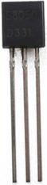
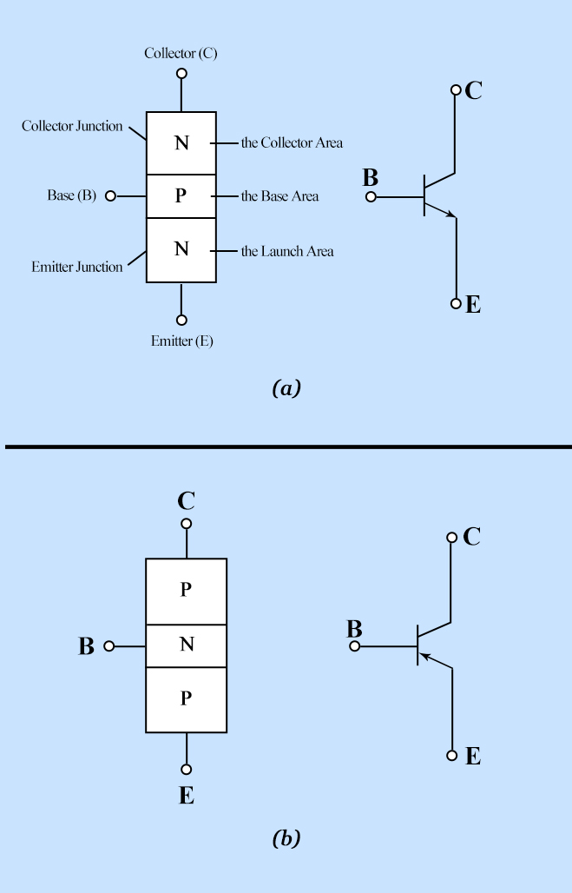

# Project 17：Small Fan

### **Introduction**

In the hot summer, we need an electric fan to cool us down, so in this project, we will use the Plus control board to control 130 motor module and small blade to make a small fan.


### **Components Required**

|  |  |  |
| ------------------------------------------------------------ | ------------------------------------------------------------ | ------------------------------------------------------------ |
| Raspberry Pi Pico*1                                          | Raspberry Pi Pico Expansion Board*1                          | DC Motor*1                                                   |
|                       |                       |                       |
| Breadboard*1                                                 | Fan*1                                                        | S8050 Triode*1                                               |
|                       |                       |                       |
| S8550 Triode*1                                               | 1KΩ Resistor*1                                               | Jumper Wires                                                 |
|                       |                       |                                                              |
| Diode*1                                                      | USB Cable*1                                                  |                                                              |


### **Component Knowledge**



**Triode：**

It is referred as the semiconductor triode and a bipolar transistor or a transistor.

The triode is one of the basic semiconductor components as the core of the electronic circuit., which can amplify current. The triode means that two PN junctions are made on a semiconductor wafer. The two PN junctions divide the entire semiconductor into three parts. The middle part is the base area, and the two sides are the emitter and collector areas.

As for NPN triode, it is composed of two N type semiconductors and a P type semiconductor.

The type of transistor which may be used in some applications in place of the triode tube is the "junction" transistor, which actually has two junctions. It has an emitter, base, and collector which correspond to the cathode, grid, and plate, respectively, in the triode tube. Junction transistors are of two types, the NPN type and the PNP type.

The PN junction between the emitting area and the base area is emitter junction and the PN junction flanked by the collector area and the base area is collector junction. And three pins are E（Emitter, B (Base)and C (Collector).

**S8050（NPN triode）**



**S8550（PNP triode）**


The S8050 transistor is a low-power NPN silicon tube and its the maximum voltage of collector and base can reach 40V and the current of the collector is (Ic) 0.5A.

The pins of the S8050 transistor should facing down, pin 1 is the emitter (E pole), pin 2 is the base (B pole), and pin 3 is the collector (C pole). Similarly, the S8550 transistor is the same.


The commonly used triodes are divided into two types: PNP type triode and NPN type triode. S8550 is the PNP type triode, S8050 is the NPN type triode, what we provide in this kit are S8050 and S8550.


### **Connection Diagram 1**

we apply the S8050(NPN triode) in this experiment to control the motor


### **Test Code 1**

The code used in this project is saved in the file KS3026 Keyestudio Raspberry Pi Pico Learning Kit Basic Edition\\3. Raspberry Pi System\\Python\_Tutorial\\2. Projects\\Project 17：Small Fan. You can move the code to anywhere, for example, we can save the code in the Disk(D), the route isD:\\2. Python Projects.


Open“Thonny”, click“This computer”→“D:”→“2. Python Projects”→“Project 17：Small Fan”. And double left-click the “Project\_17.1\_Small\_Fan.py”.


```python
from machine import Pin
import time

motor = Pin(22, Pin.OUT)   # create S8050 object from Pin 22, Set Pin 22 to output

try:
    while True:
        motor.value(1)    # Set motor turn on
        time.sleep(4) # Sleep 4s
        motor.value(0)    # Set motoe turn off
        time.sleep(2) # Sleep 2s
except:
    pass
```


### **Test Result** 1

Ensure that the Raspberry Pi Pico is connected to the computer，click“Stop/Restart backend”.


Click “Run current script”, the code starts executing, we will see that The small fan turns counterclockwise for 4 seconds and stops for 2 seconds, in a loop way. 

Press“Ctrl+C”or click“Stop/Restart backend”to exit the program.


### **Circuit Diagram and Wiring Diagram 2：**

We use the S8550 PNP triode to control a motor


### **Test Code 2**

Go to the folder KS3026 Keyestudio Raspberry Pi Pico Learning Kit Basic Edition\\3. Raspberry Pi System\\Python\_Tutorial\\2. Projects\\Project 17：Small Fan.

You can move the code to anywhere, for example, We save the code to the pi folder of the Raspberry Pi system. The path:home/pi/2. Projects


Open“Thonny”, click“This computer”→“D:”→“2. Python Projects”→“Project 17：Small Fan”. And double left-click the“Project\_17.2\_Small\_Fan.py”.


```python
from machine import Pin
import time

motor = Pin(22, Pin.OUT)   # create S8550 object from Pin 22, Set Pin 22 to output

try:
    while True:
        motor.value(0)    # Set motor turn on
        time.sleep(4) # Sleep 4s
        motor.value(1)    # Set motoe turn off
        time.sleep(2) # Sleep 2s
except:
    pass
```


### **Test Result 2**

Ensure that the Raspberry Pi Pico is connected to the computer，click“Stop/Restart backend”.


Click “Run current script”, the code starts executing, we will see that The small fan turns counterclockwise for 4 seconds and stops for 2 seconds, in a loop way. 

Press“Ctrl+C”or click“Stop/Restart backend”to exit the program.


