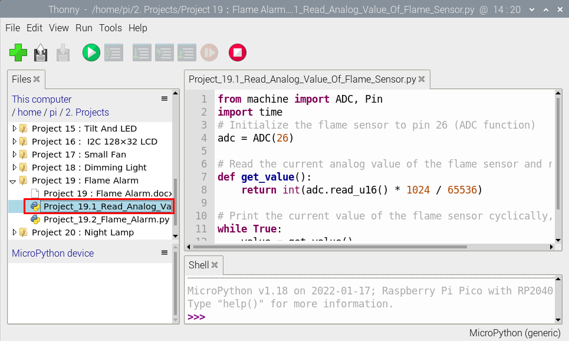

# Project 19：Flame Alarm

### **Introduction**

Fire is a terrible thing and fire alarm systems are very useful in houses, commercial buildings and factories. In this project, we will use a Raspberry Pi Pico to control a flame sensor , a buzzer and LED to make fire alarm devices, which is a meaningful maker activity.


### **Components Required**

|  |  |  |  |  |
| ------------------------------------------------------------ | ------------------------------------------------------------ | ------------------------------------------------------------ | ------------------------------------------------------------ | ------------------------------------------------------------ |
| Raspberry Pi Pico*1                                          | Raspberry Pi Pico Expansion Board*1                          | Flame Sensor*1                                               | Red LED*1                                                    | Active Buzzer*1                                              |
|  |  |  |  |  |
| Breadboard                                                   | 220ΩResistor*1                                               | 10KΩResistor*1                                               | Jumper Wires                                                 | USBCable*1                                                   |


### **Component Knowledge**


**Flame Sensor**：

The flame emits a certain degree of IR light, which is invisible to the human eye, but our flame sensor can detect it and alert the microcontroller. If the Raspberry Pi Pico has detected a fire, it has a specially designed infrared receiver to detect the flame, and then convert the flame brightness into a fluctuating level signal. 

The short pin of the receiving triode is negative pole and the other long pin is positive pole. We should connect the short pin (negative pole) to 5V and the long pin (positive pole) to the analog pin, a resistor and GND. As shown in the figure below.


Note: 

Since vulnerable to radio frequency radiation and temperature changes, the flame sensor should be kept away from heat sources like radiators, heaters and air conditioners, as well as direct irradiation of sunlight, headlights and incandescent light.


### **Read the Simulation Value**

We start with a simple code to read the value of the flame sensor and print it on the serial monitor. For wiring, please refer to the following wiring diagram.


The code used in this project is saved in the file KS3026 Keyestudio Raspberry Pi Pico Learning Kit Basic Edition\3. Raspberry Pi System\Python_Tutorial\2. Projects\Project 19：Flame Alarm. 

You can move the code anywhere. We save the code to the pi folder of the Raspberry Pi system. The path:home/pi/2. Projects


Open“Thonny”, click“This computer”→“home”→“pi”→“2. Projects”→”Project 19：Flame Alarm”. And double left-click “Project\_19.1\_Read\_Analog\_Value\_Of\_Flame\_Sensor.py”.



```python
from machine import ADC, Pin
import time
# Initialize the flame sensor to pin 26 (ADC function)
adc = ADC(26)

# Read the current analog value of the flame sensor and return [0, 1023]
def get_value():
    return int(adc.read_u16() * 1024 / 65536)
 
# Print the current value of the flame sensor cyclically, value=[0, 1023]
while True:
    value = get_value()
    print(value)
    time.sleep(0.1)
```


Ensure that the Raspberry Pi Pico is connected to the computer，click“Stop/Restart backend”.


Click “Run current script”, the code starts executing, we will see that the "Shell" window of Thonny IDE will print the simulation value read by the flame sensor. 

When the flame is close to the sensor, the simulation value increases. On the contrary, the simulated value decreases. 

Press“Ctrl+C”or click“Stop/Restart backend”to exit the program.


### **Circuit Diagram and Wiring Diagram**

Next, we will use flame sensor and buzzer, an RGB LED to make an interesting project, that is flame alarm. When flame is detected, RGB LED is red and buzzer alarms.


### **Test Code**

Note： The threshold of 500 in the code can be reset itself as required.

Go to the folder KS3026 Keyestudio Raspberry Pi Pico Learning Kit Basic Edition\\3. Raspberry Pi System\\Python\_Tutorial\\2. Projects\\Project 19：Flame Alarm.

You can move the code anywhere. We save the code to the pi folder of the Raspberry Pi system. The path:home/pi/2. Projects


Open“Thonny”, click“This computer”→“home”→“pi”→“2. Projects”→Project 19：Flame Alarm”. And double left-click the“Project\_19.2\_Flame\_Alarm.py”.


```python
from machine import ADC, Pin
import time

# Initialize the flame sensor to pin 26 (ADC function)
adc = ADC(26)
# create LED object from Pin 16,Set Pin 16 to output
led = Pin(16, Pin.OUT) 
# create buzzer object from Pin 17, Set Pin 17 to output
buzzer = Pin(17, Pin.OUT)   

# Read the current analog value of the flame sensor and return [0, 1023]
def get_value():
    return int(adc.read_u16() * 1024 / 65536)
 
# If the flame sensor detects a flame, the buzzer will beep
# and the LED will blink when the analog value is greater than 500
# Otherwise, the buzzer does not sound and the LED goes off 
while True:
    value = get_value()
    if value >500:
        buzzer.value(1)    # Set buzzer turn on
        led.value(1)    # Set led turn on
        time.sleep(0.5) # Sleep 0.5s
        led.value(0)    # Set led turn off
        time.sleep(0.5) # Sleep 0.5s
    else:
        buzzer.value(0)    # Set buzzer turn off
        led.value(0)    # Set led turn off
```


### **Test Result**

Ensure that the Raspberry Pi Pico is connected to the computer，click“Stop/Restart backend”.


Click“Run current script”, the code starts executing, we will see that when the flame sensor detects the flame, the LED flashes and the buzzer alarms. Otherwise, the LED does not light, the buzzer does not sound. 

Click“Stop/Restart backend”to exit the program.


