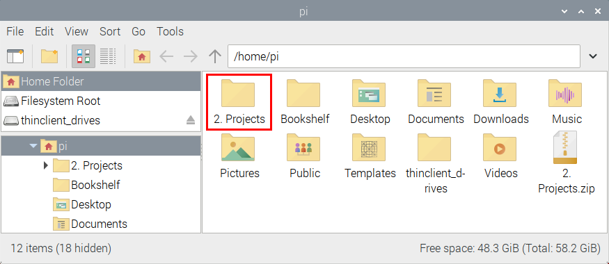

# Project 21：Temperature Instrument

### **Introduction**

Thermistor is a kind of resistor whose resistance depends on temperature changes, which is widely used in gardening, home alarm system and other devices. Therefore, we can use this feature to make a temperature instrument.

### **Components Required**

|  |              |  |  |                         |
| ----------------------- | ----------------------------------- | ----------------------- | ----------------------- | ----------------------- |
| Raspberry Pi Pico*1     | Raspberry Pi Pico Expansion Board*1 | Thermistor*1            | 10KΩResistor*1          |                         |
|  |              |  |  |  |
| 10CM M-F Dupont Wires   | Breadboard*1                        | LCD 128X32 DOT*1        | Jumper Wires            | USB Cable*1             |


### **Component Knowledge**

Thermistor: 

A thermistor is a temperature sensitive resistor. When it senses a change in temperature, the thermistor's resistance changes. We can use this feature to detect temperature intensity with thermistor. 

Thermistors and its electronic symbols are shown below:


The relation between thermistor resistance and temperature is:


**In the formula: **

**Rt** is the resistance of the thermistor at T2 temperature.

**R** is the nominal resistance value of the thermistor at T1 room temperature.

**EXP\[n\]** is the nth power of e.

**B** is the temperature index

**T1** and **T2** refer to K degrees, that is, Kelvin temperature. 

Kelvin temperature =273.15 + Celsius temperature. 

For thermistor parameters, we use : B=3950, R=10KΩ，T1=25℃.The circuit connection method of thermistor is similar to that the photoresistor, as shown below :


We can use the value measured by the ADC converter to get the resistance value of the thermistor, and then use the formula to get the temperature value. Therefore, the temperature formula can be deduced as:


### **Read the Values**

First we will learn the thermistor to read the current ADC value, voltage value and temperature value and print them out . Please connect the wires according to the following wiring diagram.


The code used in this project is saved in the file KS3026 Keyestudio Raspberry Pi Pico Learning Kit Basic Edition\\3. Raspberry Pi System\\Python\_Tutorial\\2. Projects\\Project 21:Temperature Instrument You can move the code anywhere. We save the code to the pi folder of the Raspberry Pi system. The path:home/pi/2. Projects.



Open“Thonny”, click“This computer”→“home”→“pi”→“2. Projects”→“Project 21：Temperature Instrument””. And double left-click the“Project\_21.1\_Read\_the\_thermistor\_analog\_value.py”.


```python
from machine import Pin, ADC
import time
import math

#Set ADC
adc=ADC(27)

try:
    while True:
        adcValue = adc.read_u16()
        voltage = adcValue / 65535.0 * 3.3
        Rt = 10 * voltage / (3.3-voltage)
        tempK = (1 / (1 / (273.15+25) + (math.log(Rt/10)) / 3950))
        tempC = int(tempK - 273.15)
        print("ADC value:", adcValue, "  Voltage: %0.2f"%voltage + "V",
              "  Temperature: " + str(tempC) + "C")
        time.sleep(1)
except:
    pass
```


Ensure that the Raspberry Pi Pico is connected to the computer，click“Stop/Restart backend”.


Click “Run current script”, the code starts executing, we will see that the "Shell" window of Thonny IDE will continuously display the thermistor's current ADC value, voltage value, and temperature value.  

Press“Ctrl+C”or click“Stop/Restart backend”to exit the program.


### **Circuit Diagram and Wiring Diagram**

Note : LCD\_128X32\_DOT must be connected with a 10CM M-F Dupont wire, the LCD\_128X32\_DOT will display normally. 

Otherwise, using a 20CM M-F Dupont wire may cause the LCD\_128X32\_DOT display abnormally.  


### **Test Code**

The code used in this project is KS3026Keyestudio Raspberry Pi Pico Learning Kit Basic Edition\\3. Raspberry Pi System\\Python\_Tutorial\\2. Projects\\Project 21：Temperature Instrument. We save the code to the pi folder of the Raspberry Pi system. The path:home/pi/2. Projects.


Open“Thonny”, click “This computer”→“home”→“pi”→“2. Projects”→”Project 21:Temperature Instrument”. And click the “Project\_21.2\_Temperature\_Instrument.py”.


```python
from machine import Pin, ADC, I2C
import time
import math
import lcd128_32_fonts
from lcd128_32 import lcd128_32

#Set ADC
adc=ADC(27)

#i2c config
clock_pin = 21
data_pin = 20
bus = 0
i2c_addr = 0x3f
use_i2c = True

def scan_for_devices():
    i2c = machine.I2C(bus,sda=machine.Pin(data_pin),scl=machine.Pin(clock_pin))
    devices = i2c.scan()
    if devices:
        for d in devices:
            print(hex(d))
    else:
        print('no i2c devices')

try:
    while True:
        adcValue = adc.read_u16()
        voltage = adcValue / 65535.0 * 3.3
        Rt = 10 * voltage / (3.3-voltage)
        tempK = (1 / (1 / (273.15+25) + (math.log(Rt/10)) / 3950))
        tempC = int(tempK - 273.15)
        
        if use_i2c:
            scan_for_devices()
            lcd = lcd128_32(data_pin, clock_pin, bus, i2c_addr)
            
        lcd.Clear()
        lcd.Cursor(0, 0)
        lcd.Display("Voltage:")
        lcd.Cursor(0, 8)
        lcd.Display(str(voltage))
        lcd.Cursor(0, 20)
        lcd.Display("V")
        lcd.Cursor(2, 0)
        lcd.Display("Temperature:")
        lcd.Cursor(2, 12)
        lcd.Display(str(tempC))
        lcd.Cursor(2, 15)
        lcd.Display("C")
        time.sleep(0.5)
except:
    pass
```


### **Test Result**

Ensure that the Raspberry Pi Pico is connected to the computer，click“Stop/Restart backend”.


Click“Run current script”, the code starts executing, we will see that the LCD 128X32 DOT displays the voltage value of the thermistor and the temperature value in the current environment. 

Click“Stop/Restart backend”to exit the program.


